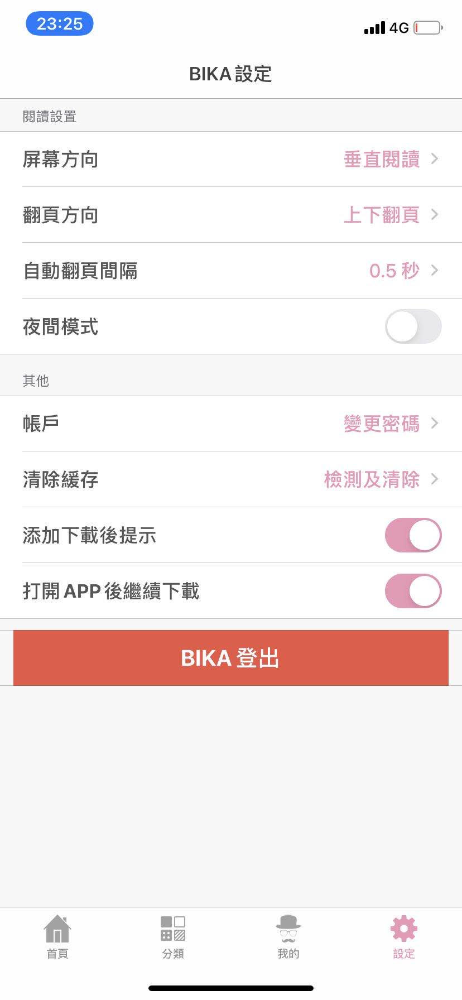
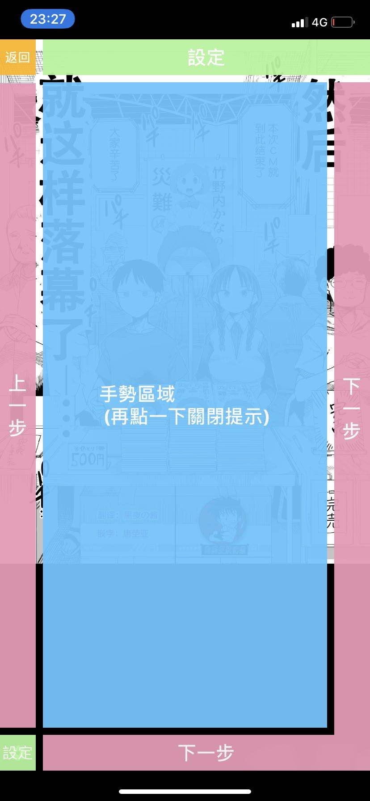

# 18comic


**仅供学习参考**

基于 `uniapp` + `typescript` 开发的一个看漫画的软件(雾)

自豪的使用 `vscode` 来开发


# 下载♂安装

参见 `releases` 下

# 界面

完全借(chao)鉴(xi)了 `picacg`

**实际的页面和下面的效果图有很大出入**

|    |            |   |
|----------|:-------------:|------:|
|  |   |   |
|  |   |   |
|  |   |   |
|  |   |   |

# FAQ

1. 为什么要做这么个东西?

主要是为了写一个完整的 `uniapp` 的项目练手, 实际上也是因为现在这个项目的源站广告特别多,毕竟要♂恰饭的啊, 而 `哔咔` 又♂用不了. 其实官方是有 `app` 的. 不过特别敷衍, 截止 `2020-06-12`, 官方的APP大小`30m`左右, 直接是一个 `webview` 套壳...


而用 `uniapp` 打包的不超过可以 `10m`


2. 太卡了太卡了, 一直是 `loading` 状态

是的, 我同样也出现了, 可以试着去切换节点试试

**要不老铁你科学上网试一下?准行..**

3. `ios` 怎么安装

```
https://impactor.nullx.me
```

4. 有没有彩蛋?

> 在设置页面狂按版本号可开启新世界...